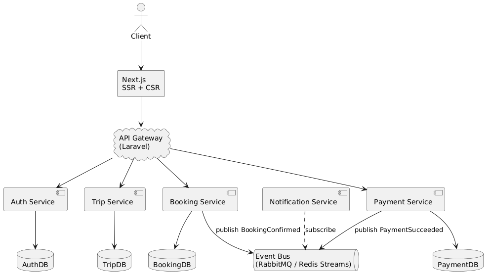
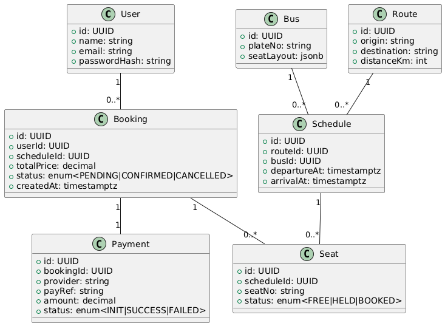
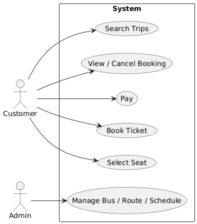
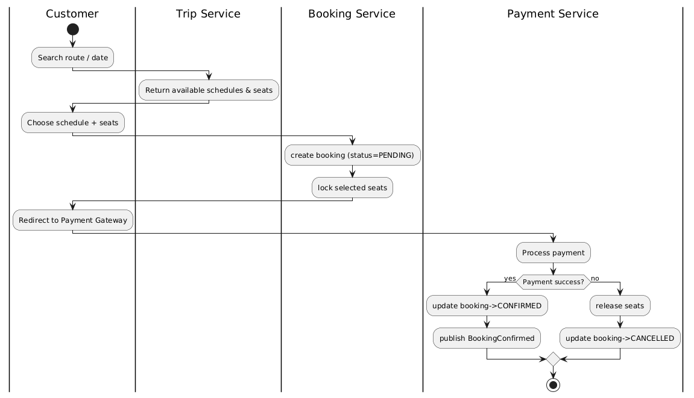

# ระบบจองตั๋วรถทัวร์ (Bus Ticket Booking System)

เว็บแอป หรือถ้าต้องการเป็นโมบายแอปใช้ React Native แทน Next.js สำหรับค้นหาเที่ยวรถ เลือกที่นั่ง จอง จ่ายเงิน และรับอีเมลยืนยัน - พัฒนาด้วย **Laravel Micro-services + Next.js** และใช้ **PostgreSQL** เป็นฐานข้อมูลหลัก พร้อม Event-Driven Architecture เชื่อมแต่ละบริการผ่าน RabbitMQ/Redis Streams

---

## Table of Contents
1. [ภาพรวมระบบ](#ภาพรวมระบบ)
2. [สถาปัตยกรรม](#สถาปัตยกรรม)
3. [รายละเอียด Micro-services](#รายละเอียด-microservices)
4. [โฟลว์การทำงานหลัก](#โฟลว์การทำงานหลัก)
5. [Diagram](#Diagram)
6. [เทคโนโลยีที่ใช้](#เทคโนโลยีที่ใช้)
7. [การเตรียมระบบ](#การเตรียมระบบ)
8. [ตัวอย่าง .env](#ตัวอย่าง-env)
9. [API Endpoints ย่อ](#api-endpoints-ย่อ)

---

## ภาพรวมระบบ

| คุณสมบัติ | คำอธิบาย |
|-----------|----------|
| ค้นหาเที่ยวรถ | เลือกเส้นทาง วันที่ เวลา และดูจำนวนที่นั่งคงเหลือแบบ Real-time |
| เลือกที่นั่ง | ระบบแสดงแผนผังรถ สามารถเลือก/เปลี่ยนที่นั่งได้ | 
| จอง & จ่าย | ยืนยันการจอง, ชำระเงินผ่าน Payment Gateway (QR/บัตร) |
| แจ้งเตือน | ส่งอีเมล/LINE/SMS เมื่อจองสำเร็จหรือยกเลิก |
| จัดการหลังบ้าน | Admin จัดการรถ เส้นทาง ตารางเดินรถ ราคา |

---

## สถาปัตยกรรม



โครงสร้าง Service + Data Store + Event Bus
* **Gateway** รวม rate-limit / auth middleware / aggregation
* **Event Bus** เชื่อม Booking → Payment → Notification ลดการ coupling
* บริการทุกตัวเป็น **Stateless Docker Container** scale ได้อิสระ

---

## รายละเอียด Micro-services

| Service | Port | หน้าที่ | ฐานข้อมูล (Schema) |
|---------|--------------|---------|---------------------|
| Auth            | `7001` | สมัคร/ล็อกอิน, JWT, Refresh Token | `auth` |
| Trip            | `7002` | รถ, เส้นทาง, ตารางเดินรถ, ที่นั่งคงเหลือ | `trip` |
| Booking         | `7003` | สร้าง/ยกเลิกการจอง, ล็อกที่นั่ง (TX) | `booking` |
| Payment         | `7004` | เชื่อม Payment Gateway, Callback | `payment` |
| Notification    | `7005` | ส่งอีเมล/LINE/SMS เมื่อเกิด Event | - |

> **หมายเหตุ** Service อื่นถือแค่ `user_id` / `booking_id` ไม่ซ้ำซ้อนข้อมูลระหว่าง DB

---

## โฟลว์การทำงานหลัก

1. **Customer** ค้นหาเส้นทาง & วันที่ → `Trip Service` ตอบกลับเที่ยวรถและที่นั่งว่าง
2. เลือกที่นั่ง → Frontend ส่งข้อมูลไป `Booking Service`
3. `Booking Service` สร้าง `booking(status=PENDING)` + ล็อกที่นั่งด้วย Row-level Lock (FOR UPDATE)
4. Redirect ไปหน้า Payment (QR หรือ 3-D Secure) → `Payment Service` ดำเนินการ
5. ถ้าชำระสำเร็จ →
   * `Payment Service` อัปเดต `payment.status=SUCCESS`
   * Publish Event **PaymentSucceeded**
6. `Booking Service` (consumer) → เปลี่ยน `booking.status=CONFIRMED` & publish **BookingConfirmed**
7. `Notification Service` รับ Event ส่งอีเมลตั๋วให้ลูกค้า

---

## Diagram

| Diagram | Preview | คำอธิบาย |
|---------|---------|-----------|
| Class |  | Entity หลัก (User, Bus, Schedule, Booking, Payment, Seat) |
| Use Case |  | กรณีใช้งานของ Customer / Admin |
| Activity |  | Booking Flow ตั้งแต่ค้นหาถึงจบการจอง |

---

## เทคโนโลยีที่ใช้

* **Frontend**         : Next.js 15 + TypeScript + Tailwind CSS + React Query  
* **Backend**          : Laravel 11 (API Mode) - แยก 5 Micro-services  
* **Database**         : PostgreSQL 16 (UUID PK, JSONB, Row-level Locking)  
* **Message Bus**      : RabbitMQ หรือ Redis Streams (เลือกตามบริบท)  
* **Auth**             : JWT (HS256) + Refresh Token Rotation  
* **Containerization** : Docker, Docker Compose  

---

## การเตรียมระบบ

### Prerequisites
| Tool | เวอร์ชัน |
|------|----------------|
| Docker & Docker Compose | v24 |
| Node.js                 | 20 LTS |
| pnpm (แนะนำ)            | 8 |

---

## ตัวอย่าง .env

```dotenv
#GLOBAL
COMPOSE_PROJECT_NAME=busbooking
TIMEZONE=Asia/Bangkok

#Auth Service
AUTH_DB_USER=auth
AUTH_DB_PASS=secret
JWT_SECRET=change_me

#Trip Service
TRIP_DB_USER=trip
TRIP_DB_PASS=secret

# Service อื่น ๆ
```

---

## API Endpoints ย่อ

| Method | URL | Service | ใช้ทำอะไร |
|--------|-----|---------|-----------|
| POST | `/api/auth/register` | Auth | สมัครสมาชิก |
| POST | `/api/auth/login` | Auth | เข้าสู่ระบบ (JWT) |
| GET  | `/api/trips?origin=BKK&dest=CNX&date=2025-12-24` | Trip | ค้นหาตารางเดินรถ |
| POST | `/api/bookings` | Booking | สร้างการจอง |
| POST | `/api/payments` | Payment | สร้าง Transaction ชำระเงิน |
| GET  | `/api/bookings/:id` | Booking | ดูสถานะการจอง |
| DELETE | `/api/bookings/:id` | Booking | ยกเลิกการจอง (คืนที่นั่ง) |

> ทุก Endpoint (ยกเว้น `register/login`) ต้องส่ง Header:  
`Authorization: Bearer <JWT>`